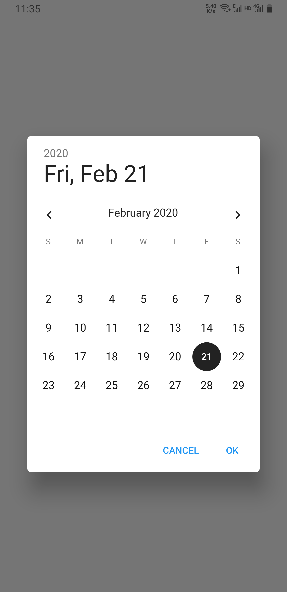
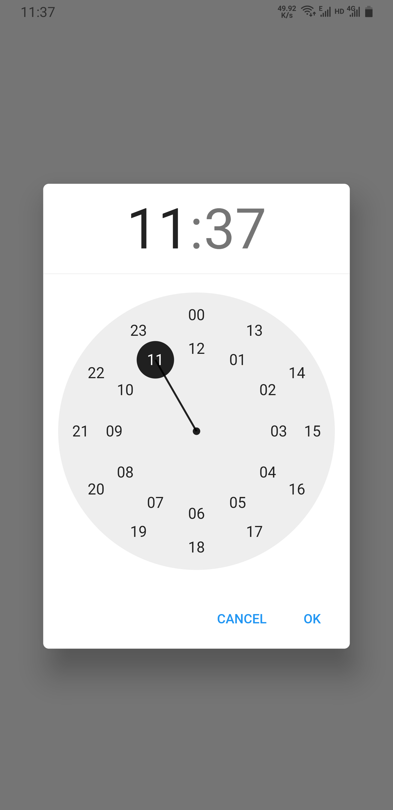

# flutter Date & Time Picker Border Radius Diff

Make Flutter's DatePicker and TimePicker widget borders appear rounded.

## Screenshots




## Change Border Radius

Default border radius is 6.

1. search & replace "6" in diff

## Diff files

- **date_picker_border_radius.diff** : only diff of DatePicker
- **time_picker_border_radius.diff** : only diff of TimePicker
- **date_time_picker_border_radis.diff** : both diff of TimePicker and DatePicker

## Apply Diff

1. Go to **$FLUTTER_HOME/packages/flutter/lib/src/material/**
2. Copy diff to this directory
3. exec apply
```shell
git apply --check date_time_picker_border_radis.diff
git apply date_time_picker_border_radis.diff
```
